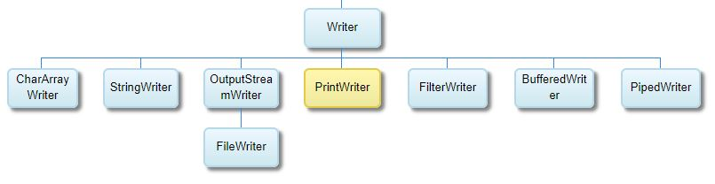

# Introduction 
这是一个Java IO 面试题 + 代码演示

主要专注于IO
# What is the difference between IO and NIO?
Main difference between NIO and IO is that NIO provides asynchronous, non blocking IO, which is critical to write faster and scalable networking systems. 

# 如何创建 a directory in Java?
不像C#有Directory类专门处理folder. Java是用File类

详情见Demo1

# What is the difference between InputStream and OutputStream in Java?
InputStream is used to read data from source like File, Socket or Console, while OutputStream is used to write data into destination like a File, Socket or Conole.

InputStream和OutputStream都是Top类，其他相关类都是从他们继承而来。

[InputStream OutputStream hierarchy diagram](http://journals.ecs.soton.ac.uk/java/tutorial/java/io/overview.html)

详见IOTest的测试方法

# What is the difference between FileInputStream and FileReader in Java IO?
The difference between FileInputStream and FileReader is, FileInputStream reads the file byte by byte and FileReader reads the file character by character.

See Demo 2

# 如何读text file into line?
用BufferedReader

see Demo 3

# Reader类 层次结构

# Writer类 层次结构

# BufferedReader and FileReader 区别
BufferedReader is a Decorator that provides buffering for faster IO, while FileReader is used to read data from File.

# BufferedReader and Scanner 区别
BufferedReader 只能读取 String，而Scanner可以读取String和其他数据类型，例如int，float，long，double，float等。

FileReader is just a Reader which reads a file, using the platform-default encoding (urgh)

BufferedReader is a wrapper around another Reader, adding buffering and the ability to read a line at a time

Scanner reads from a variety of different sources, but is typically used for interactive input. 

# What is the use of the PrintStream class in Java IO?
 PrintStream is used to write data on Console, for example System.out.println(), here out is an object of PrintStream class and we are calling println() method from that class.

#Can you open a ZIP file in Java? How?
 java.util.zip.ZipFile
 
 java.util.zip.ZipInputStream
 
 See demo 5
# When does java.io.FileNotFoundException: (Access is denied) comes?
 1. first reason is do not have permission
 2. if some other process is using that file
 
 # How do you get the default character encoding in Java?
 1) "file.encoding" system property
 The easiest way to get default character encoding in Java is to call System.getProperty("file.encoding"), which will return default character encoding if JVM started with -Dfile.encoding property or program has not called System.setProperty("file.encoding, encoding). in the later case, it may just give the value of that system property while various
 
 2) java.nio.Charset
 java.nio.Charset provides a convenient static method Charset.defaultCharset() which returns default character encoding in Java. Check the example of getting default char encoding in java using Charset in the code section.
 
 3) by using Code InputStreamReader.getEncoding()
 This is kind of shortcut where you use default constructor of InputStreamReader and then later gets which character encoding it has used by calling reader.getEncoding() . See the code example of how to get default character encoding using InputStreamReader.getEncoding() method in code section.
 
 See demo 7

# Can you delete a directory with files in Java?
  不行，得先删除子文件夹和文件，可以通过递归，或者第三方

# What is a memory-mapped file in Java?
Memory mapped files are special files in Java which allows Java program to access contents  directly from memory, 

this is achieved by mapping whole file or portion of file into memory and operating system takes care of loading page requested and writing into file while application only deals with memory which results in very fast IO operations. 

Memory used to load Memory mapped file is outside of Java heap Space. Java programming language supports memory mapped file with java.nio package and has MappedByteBuffer to read and write from memory.

The key advantage of  Memory Mapped File is that the operating system takes care of reading and writing and even if your program crashed just after writing into memory. OS will take care of writing content to File. 

# How do you convert an InputStream into String in Java?
  1. Using Java 5 Scanner, see Demo 9
  2. Using BufferedReader read line by line
  3. Using Apache IOUtils library
  4. Using Google's guava-libraries
  5. Using IOUtils.copy and StringWriter

# Read full text as a string
String data = new String(Files.readAllBytes(Paths.get("file.txt")));

# File.delete vs Files.delete
File is from package java.io, which is an old package, whereas Files is from java.nio, which is a later one.

Method delete of File is a non-static method, delete from Files is a static one.

File#delete 提供错误异常处理机制，而Files#delete没有

[讨论](http://mail.openjdk.java.net/pipermail/core-libs-dev/2012-August/011314.html)

# How to copy file?
1. Use FileOutputStream, see extractEntry in Main.java
2. FileUtils.copyFile(sourceFile, targetFile); FileUtils is from Apache Commons IO

# How to check file or directory permission?
File#canRead, File#canWrite

# How to read XML file?
1. BufferedReader或FileInputStream
2. org.w3c.dom.Document
3. com.jcabi.xml.XMLDocument

# How do you serialize an Object?
用ObjectInputStream and ObjectOutputStream

# What is difference between FileInputStream and ObjectInputStream
ObjectInputStream可以直接将数据转换为Java对象，然后用cast转换为相应类型的对象。

通常这些类都继承了Serializable类

# What is RandomAccessFile?
RandomAccessFile它允许对文件中的任何位置进行非顺序或随机访问。这意味着如果您想读取第10行，则无需从第一行开始，可以直接转到第10行进行读取。
                
        See Demo 15
        
# Serializable 和 Externalizable 区别
最大的区别在于Externalizable可以override读和写的方法，使用自己的input和output

See Demo 16

而Serializable相当于一个标志一样，它没有任何方法需要实现

[参考](https://howtodoinjava.com/java/serialization/externalizable-vs-serializable/)